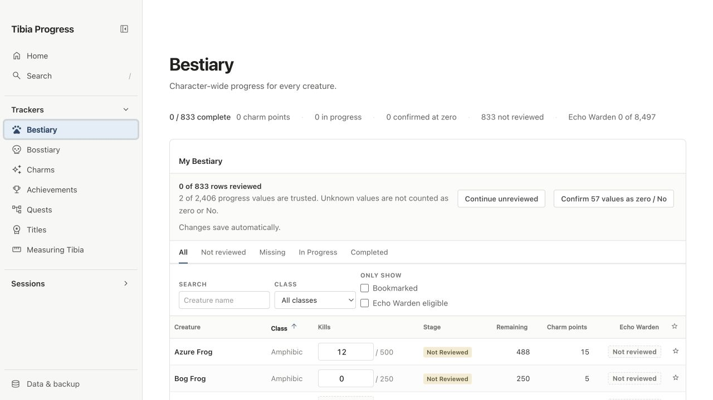
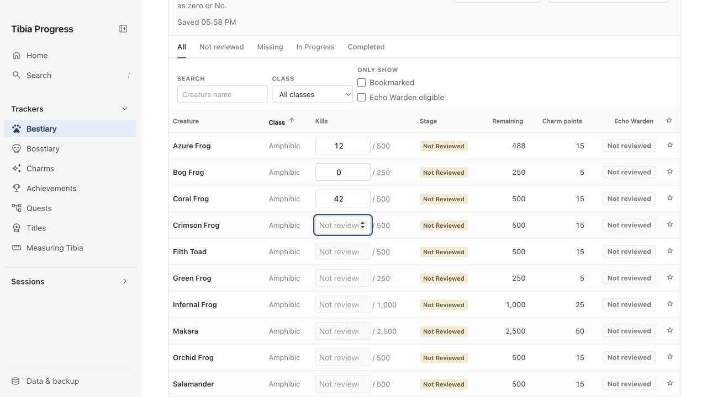
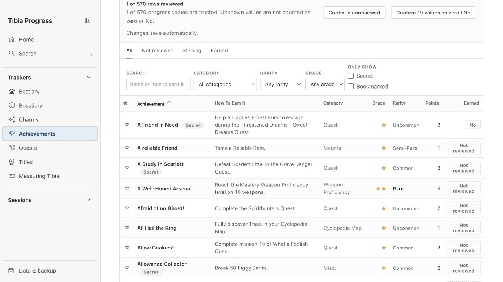

# Tracker data-entry workflow re-audit

Date: 2026-08-11

## Verdict

The rejected workflow is still a database editor. It reduces some keystrokes, but it does not match the real job: reading one bounded surface in the Tibia client and bringing that evidence into the site without losing place or inventing facts.

The replacement must organize work into **source-screen passes**, not rows. An incomplete pass contains unknown values. Completing a pass explicitly converts its untouched items to zero or No. This removes the need to touch every row without pretending that an untouched row was reviewed.

## Product definition

- **What is the product?** A character progress ledger that mirrors Tibia's character-owned Cyclopedia and quest progress and turns it into planning information.
- **Who is it for?** A Tibia player maintaining one character's progress, usually by reading the game client and entering data manually.
- **Why will they use it?** To know what is complete, what remains, and what to do next without reconstructing progress every visit.
- **One key action:** Synchronize one trustworthy, bounded part of the character's Tibia progress.

## Audited task

Goal: manually synchronize Bestiary and achievement data from Tibia into the site.

### Step 1 — Enter the Bestiary tracker: poor

The first actionable state presents 833 rows, several filters, three facts per Bestiary entry, a progress summary, and a bulk confirmation. Nothing tells the user which Tibia screen to open, which field to copy first, or what constitutes a safe stopping point.

### Step 2 — Enter one kill count: poor

Keyboard movement is efficient in isolation, but the workflow remains wrong. The user is expected to move through the site's order, not the source's order. The row still asks for Echo Warden alongside kills even though those facts may be checked in a different pass. Derived values can also lag the edit until a later render, weakening confidence.

### Step 3 — Enter achievement ownership: poor

The user must distinguish Not reviewed, Yes, and No one row at a time across 570 entries. The efficient real-world action is to mark the achievements present in one client category and then confirm the rest of that bounded category as absent.

## Root cause

The rejected workflow has the wrong unit of completion.

- **Wrong unit:** row or field.
- **Correct unit:** one source-aligned pass, such as “Bestiary kills · Amphibic” or “Achievements · Quest”.
- **Wrong start:** open a tracker table.
- **Correct start:** choose whether this is a first/full sync, a small ongoing change, or evidence awaiting review.
- **Wrong default work:** answer every Yes/No and zero individually.
- **Correct default work:** enter exceptions, then explicitly confirm the untouched remainder of the current bounded pass.
- **Wrong Bestiary model:** kills, Echo Warden, and Animus form one review task.
- **Correct Bestiary model:** each source surface is its own pass and completion timestamp.

## Research applied

- Tibia's own guide describes Bestiary, Bosstiary, achievements, titles, and the Cyclopedia Map as separate client surfaces. The site should mirror those source boundaries instead of merging them into one generic row task: <https://www.tibia.com/gameguides/?section=interface&subtopic=manual>
- The GOV.UK task-list guidance is appropriate for long work completed over several sittings: show bounded tasks, their status, save progress, and resume where the user left off: <https://design-system.service.gov.uk/components/task-list/> and <https://design-system.service.gov.uk/patterns/complete-multiple-tasks/>
- GOV.UK recommends check-answer steps for confidence and error reduction, with section-level checks for very large transactions: <https://design-system.service.gov.uk/patterns/check-answers/>
- High-volume grid products optimize for direct editing, Return/Tab/arrow navigation, multi-cell selection, paste, and applying one value to several selected records: <https://trailhead.salesforce.com/content/learn/modules/lightning-experience-for-salesforce-classic-users/work-with-list-views> and <https://support.airtable.com/airtable-keyboard-shortcuts>
- W3C guidance says stored user data changes should be reversible, checked, or confirmed, and that users should be able to review and correct entries: <https://www.w3.org/WAI/tutorials/forms/validation/>

## Replacement journey

### 1. Start an update

The primary action is **Update progress**. It offers three paths:

1. **Set up or fully check a tracker** — create or refresh a baseline from Tibia.
2. **Record a few changes** — search for an item and set its current total/state.
3. **Review detected changes** — inspect imports or session evidence before it changes the ledger.

The normal tracker page remains for reading and planning. It is not the main data-entry surface.

### 2. Choose a bounded pass

The setup path becomes a task list whose grouping matches the Tibia source:

| Tracker | Pass unit | Entry action | Pass completion |
| --- | --- | --- | --- |
| Bestiary kills | Creature class | Enter non-zero/current totals | Review entered totals; confirm untouched creatures in this class as zero |
| Echo Warden | Its own eligible-creature pass | Mark creatures with the bonus | Confirm untouched eligible creatures as No |
| Animus Mastery | Its own source-aligned pass | Mark mastered creatures | Confirm untouched creatures as No |
| Bosstiary | Boss category | Enter current boss kills | Review; confirm untouched bosses in the category as zero |
| Charms | Major and Minor | Set current stage with one direct choice | Review the small set and finish the section |
| Achievements | Client category | Mark achievements earned | Confirm untouched achievements in the category as No |
| Quests | Questlog group | Mark completed quest entries | Confirm untouched entries in that questlog as No |
| Titles | Permanent/losable source grouping | Mark titles currently available/earned using correct terminology | Confirm untouched titles as No |
| Measuring Tibia | Map area | Mark discovered subareas | Confirm untouched subareas in the area as No |

Each pass has only four states: **Not started**, **In progress**, **Ready to review**, and **Synced**. These describe the transcription task, not the game item.

### 3. Transcribe exceptions

The work surface shows only the field being copied in this pass.

- Counter pass: type a creature/boss name or follow the same ordering as the selected Tibia class/category; enter the current total; Return saves and advances.
- Yes/No pass: unmarked means unknown while the pass is open. The user marks only the Yes items. No per-row No action is required.
- Paste is accepted where a rectangular list can be copied; the site previews name matches and rejects ambiguous names before commit.
- Search never resets the pass or loses the current position.

### 4. Review the pass

The review shows only decisions that will be stored:

- entered or marked Yes items;
- the count of untouched items that will become zero or No;
- out-of-range counts, unmatched pasted names, and differences from the previous baseline;
- a Change action for each exception.

The final action names the scope: **Sync 18 Amphibic Bestiary entries**, not “Confirm values”. Completion stores the pass source, timestamp, and prior values so it can be undone.

### 5. Resume or finish

After sync, return to the task list. The completed pass shows its timestamp; the next unfinished pass is suggested but not forced. Returning later opens the last in-progress pass at the same position.

## Ongoing changes

After baseline setup, the fastest path is a global **Quick update**:

1. Search for the creature, boss, charm, achievement, quest, title, or subarea.
2. Choose **Set current total/state**. The existing value is visible.
3. Enter the new value and save. The app shows the exact before → after change and offers Undo.

This is intentionally separate from the full-sync task list.

## Session and import evidence

Sessions and imports must go to a **review inbox**, not directly into progress.

- A Hunt Analyzer proposes Bestiary/Bosstiary deltas.
- The review shows prior total + session delta = proposed total.
- A session older than the latest completed baseline pass is presumed already included and is skipped unless the user explicitly overrides it.
- Reprocessing the same session cannot create a second proposal.
- Import compares at field level and shows additions, changes, conflicts, and unmatched names; it never replaces an entire tracker silently.
- Accepting a newer full baseline closes older pending deltas for the same scope as already included.

## Data model implications

- Store pass completion by `tracker + source dimension + group + character`.
- Preserve unknown only inside incomplete passes.
- On pass confirmation, persist explicit zero/No for the untouched applicable items in that pass.
- Store source, timestamp, previous value, and change id for every committed change.
- Keep session/import proposals separate from canonical progress until accepted.
- Derived totals are recalculated; users never enter them.

## Acceptance criteria

The new flow is acceptable only if all are true:

1. A first-time user knows which Tibia screen/category to open before seeing an input.
2. A user never has to click No or type zero for every item.
3. Bestiary kills, Echo Warden, and Animus are never bundled into one completion task.
4. Leaving mid-pass and returning restores the exact group and position.
5. No import or session changes canonical progress without a before/after review.
6. A completed pass can be undone.
7. The read-only tracker table is consistent across trackers, while the entry interaction is specialized for counter, stage, or Yes/No data.
8. Unknown is never reported as missing; after a pass is synced, its untouched applicable items are explicitly known zero/No.

## Story

Nesley opens Tibia's Bestiary and selects Amphibic. In Tibia Progress, he chooses **Update progress → Full check → Bestiary kills → Amphibic**. The site shows only Amphibic creature names and one total-kills input, in the same order. He enters the creatures with progress and skips the rest. At the end, a review says: “3 totals entered; 8 untouched creatures will be saved as 0.” He corrects one total, syncs the class, and returns to a list where Amphibic is stamped “Synced today” and Aquatic is next. Echo Warden is a separate task, so finishing kills never asks him to assert a flag he was not looking at.

## Evidence limits

The screenshots verify the current browser-rendered interaction and information structure. They do not prove usability with real players, screen-reader behavior, touch ergonomics, or fidelity to the exact ordering of every Tibia client category. Those require task-based testing with the game client open beside the site.
