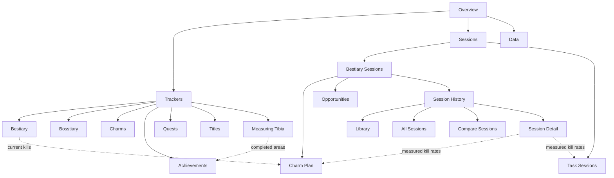
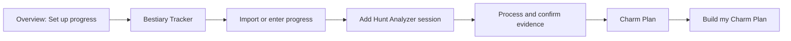
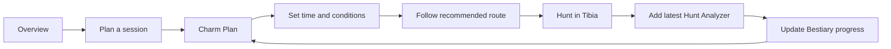
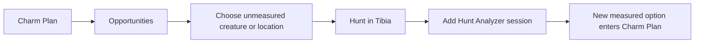
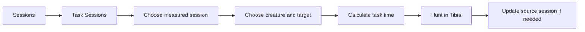

# Product Journey and Navigation Map

## Product contract

**Product:** A Tibia character-progress workspace that records long-term completion and uses real Hunt Analyzer sessions to plan future hunting.

**Audience:** Active and returning Tibia players who care about Bestiary, Bosstiary, charms, achievements, quests, titles, map discovery, or creature kill targets.

**Reason to use it:** Keep one trustworthy progress record, understand what remains, and turn measured hunting performance into a realistic next session.

**Key action:** Continue my Tibia progress.

That action has two valid destinations:

1. Update the character record in **Trackers**.
2. Decide or estimate the next hunt in **Sessions**.

The product must not force both jobs onto one screen.

## Organizing principle

> Trackers hold truth. Sessions turn truth and Hunt Analyzer evidence into decisions.

- A **tracker** is persistent, character-wide progress.
- A **session** is evidence from a Hunt Analyzer or a calculation based on that evidence.
- Bestiary progress belongs only to the Bestiary tracker. Every Bestiary session reads the same value.
- Measuring Tibia can derive earned achievements. The user should not record the same completion twice.
- Bestiary and Task sessions can share Hunt Analyzer evidence, but their calculations and outcomes remain separate.
- Import, export, backup, filters, sorting, bookmarks, and local persistence support the work. They are not primary destinations.

## Navigation hierarchy

### Global navigation

The permanent navigation contains only:

- **Overview**
- **Trackers**
- **Sessions**
- **Data**, as a utility action rather than a destination competing with the main work

The current top-level split of `Sessions / Trackers / Tasks` should become `Overview / Trackers / Sessions`. Task Sessions move inside Sessions because they use the same session evidence and are not a separate product mode.

## Screen 0 — Overview

### Purpose

Orient the player without making them understand the app's internal structure first.

### What the user sees first

1. **Continue your progress** as the page title.
2. Two primary paths:
   - **Plan a session**
   - **Update trackers**
3. A compact progress summary made from existing tracker totals:
   - Bestiary completion and unclaimed Charm Points
   - Bosstiary progress
   - owned or upgraded charms
   - achievement points
   - quests, titles, and Measuring Tibia completion
4. The most recently opened tracker or session.
5. A quiet data-status line: saved locally and number of stored sessions.

### What builds trust

- Clearly identify which values come from tracker progress and which come from saved Hunt Analyzer sessions.
- Show when Bestiary progress was last updated.
- Say `No progress recorded` instead of presenting zero as confirmed game progress.

### Primary action

**Plan a session** when enough Bestiary and session data exists. Otherwise, **Set up progress**.

### Transition

- `Plan a session` leads to the Sessions landing state.
- `Update trackers` leads to the last-used tracker, with Bestiary as the first-time default.
- A summary item leads directly to its corresponding tracker.

## Screen 1 — Trackers

### Purpose

Maintain the character-wide source of truth.

### Shared layout

- Tracker navigation lists all seven trackers.
- The selected tracker owns the page title, explanation, totals, filters, table, and import/export actions.
- Search, sorting, filtering, bookmarks, paging, and per-tracker CSV/JSON transfer remain shared controls.
- Only one tracker is visible at a time.
- Whole-workspace import/export stays under Data, not inside a tracker.

### Shared transition rule

Updating tracker progress stays on the tracker and refreshes its totals immediately. Only Bestiary and Measuring Tibia expose a contextual next action because they feed another feature directly.

## Screen 1A — Bestiary Tracker

### Purpose

Store one character-wide kill total and the Bestiary-specific flags for every creature.

### First view

- Overall completion, Charm Points, and Echo Warden points are separate totals.
- Filters emphasize `Missing`, `In progress`, `Completed`, `Bookmarked`, and relevant Bestiary categories.
- Each creature shows current kills, stage, remaining kills, Charm Points, Echo Warden, and Animus Mastery state.

### Primary action

**Update Bestiary progress.**

### Confidence to act

- Imported and manually entered progress are labeled consistently.
- Current kills are explicitly character-wide, never session-specific.
- A creature appearing in multiple sessions always reads this same total.

### Transition

**Plan with this progress** opens Charm Plan after at least one measured session exists. If none exists, it opens the Add Session state.

## Screen 1B — Bosstiary Tracker

### Purpose

Record boss kills, stage progress, and Bosstiary Points.

### First view

- Bosses grouped and filtered by category and completion stage.
- Overall earned points and completed stages appear before the table.

### Primary action

**Record boss progress.**

### Transition

Stay in Bosstiary with refreshed totals; bookmarked bosses remain the player's practical shortlist.

## Screen 1C — Charms Tracker

### Purpose

Record major and minor charm unlock and upgrade stages.

### First view

- Major and Minor are visibly separate because they use different currencies.
- Owned stages, remaining cost, effect, and total spending are visible.

### Primary action

**Update a charm stage.**

### Transition

Stay in Charms and update remaining Charm Point or Minor Charm Echo requirements.

## Screen 1D — Achievements Tracker

### Purpose

Record earned achievements and make missing achievements understandable.

### First view

- Achievement points and earned count are separate.
- Missing achievements are the useful default for a returning user.
- Requirements, category, grade, rarity, and removed status remain available.

### Primary action

**Mark an achievement earned.**

### Confidence to act

Achievements derived from Measuring Tibia are locked and explain their source instead of asking for duplicate input.

### Transition

Selecting a Measuring Tibia-derived achievement opens the relevant map area.

## Screen 1E — Quests Tracker

### Purpose

Record completed quests and expose questlog relationships and rewards.

### First view

- Open quests are the useful default.
- Search includes quest, questlog, and reward.

### Primary action

**Mark a quest completed.**

### Transition

Stay in Quests with questlog totals recalculated.

## Screen 1F — Titles Tracker

### Purpose

Record earned titles and distinguish permanent titles from those that can be lost.

### First view

- Missing titles are the useful default.
- Requirement and permanence appear beside each title.

### Primary action

**Mark a title earned.**

### Transition

Stay in Titles with earned totals recalculated.

## Screen 1G — Measuring Tibia

### Purpose

Track discovered Cyclopedia Map subareas and area completion.

### First view

- Areas are the top-level grouping; subareas are the work inside each area.
- Area completion is the headline because it earns the related achievement.
- Bestiary creature counts provide useful context but do not compete with discovery progress.

### Primary action

**Mark a subarea discovered.**

### Confidence to act

Completing an area visibly confirms that its achievement was also recorded.

### Transition

**View earned achievement** opens the corresponding Achievements row.

## Screen 2 — Sessions

### Purpose

Use measured Hunt Analyzer evidence to plan or estimate future hunting.

### First view

The user chooses between two explicit jobs:

1. **Bestiary Session** — complete Bestiary entries and earn Charm Points.
2. **Task Session** — estimate a chosen creature kill target.

This choice is remembered. Returning users resume their last session workflow.

### Trust rule

Every recommendation states that it is based on stored, measured sessions—not every possible Tibia hunting ground.

## Screen 2A — Bestiary Sessions / Charm Plan

### Purpose

Find the best combination of measured hunts for the time available.

### What the user sees first

1. The available-time input.
2. Planned respawn mode.
3. Sessions considered, with availability and exclusion reasons.
4. The generated result:
   - Charm Points obtainable
   - Bestiary entries completed
   - time used and unused
   - recommended route

### Primary action

**Build my Charm Plan.**

### What builds confidence

- Headline wording: `Best plan among your measured sessions`.
- Each route step names its source session and recorded respawn mode.
- Wrong-mode and unavailable sessions remain visible with an explanation.
- A completion reward counts only when its remaining time fits in the plan.

### Transition

- Selecting a route step opens that Session Detail.
- Selecting a creature opens its Bestiary Tracker row.
- `Find other possibilities` opens Opportunities.

### Empty state

Charm Plan shows a two-step setup rather than a blank calculator:

1. Confirm Bestiary progress.
2. Add at least one Hunt Analyzer session.

## Screen 2B — Bestiary Sessions / Opportunities

### Purpose

Show unfinished Bestiary work that the measured-session planner cannot fully reveal.

### Content order

1. **Closest to completion**
2. **Started but not covered by a stored session**
3. **Unclaimed Charm Points**
4. **Locations to investigate**

Location results must be framed as discovery leads, not definitive hunt recommendations. They do not have measured kill rates.

### Primary action

**Choose an opportunity.**

### What builds confidence

- Every result is labeled `Measured` or `Not measured`.
- A location is described as `worth investigating`, never `best place to hunt` without session evidence.
- The page explains whether an opportunity came from Bestiary progress, location metadata, or an uncovered creature.

### Transition

- A measured creature opens its Session Detail.
- An unmeasured creature opens its Bestiary row and offers **Add a session after hunting it**.

## Screen 2C — Bestiary Sessions / Session History

### Purpose

Manage the evidence behind all Bestiary estimates without exposing Library, All Sessions, Compare, and individual session tabs as competing top-level destinations.

### First view

A session list with name, date, duration, respawn mode, creatures, notes, availability, and analysis status.

### Primary action

**Add Hunt Analyzer session.**

### Secondary views

- **Library** is the default list and management view.
- **All Sessions** is the aggregated Bestiary estimate.
- **Compare** ranks comparable sessions by the same Bestiary metric.
- **Session Detail** edits one session and shows its creature estimates.

These are views inside Session History, not siblings of Charm Plan and Opportunities.

### Transition

- Adding a session opens Session Detail with the Hunt Analyzer editor expanded.
- Selecting a saved session opens Session Detail with the editor collapsed.
- After processing, the user can return to Charm Plan or use the session for a Task Session.

## Screen 2D — Session Detail

### Purpose

Turn one Hunt Analyzer into reusable measured evidence.

### Content order

1. Session identity: name, hunt date, duration, notes.
2. Recorded conditions: Regular or Rapid Respawn.
3. Collapsible Hunt Analyzer source.
4. Matched creatures and measured kill rates.
5. Bestiary estimates using character-wide progress.
6. Availability for Charm Plan.

### Primary action

For a new session: **Process Hunt Analyzer**. For a saved session: **Use in Charm Plan**.

### What builds confidence

- Parsed duration and creature counts are shown immediately after processing.
- Unmatched creatures are named rather than silently ignored.
- The page distinguishes session kills, which measure rate, from total Bestiary kills, which measure progress.
- Recorded respawn mode travels with every estimate.

### Transition

- `Use in Charm Plan` opens the plan with the session enabled.
- `Estimate a task` opens Task Sessions with this session preselected.

## Screen 2E — Task Sessions

### Purpose

Estimate how long a chosen kill target will take using a measured session rate.

### What the user sees first

1. Saved session selector.
2. Creature selector limited to creatures measured in that session.
3. Target kills.
4. Current or already-counted kills when applicable.
5. Estimated remaining kills and time.
6. The session's recorded respawn mode.

### Primary action

**Calculate task time.**

### What builds confidence

- The page calls this a target estimate, not an official Task Board mirror.
- The exact session used as evidence is always visible.
- The estimate does not introduce Charm Points, Charm Plan availability, or Bestiary completion unless the player deliberately returns to the Bestiary workflow.

### Transition

- `Review source session` opens Session Detail.
- `Try another session` changes the evidence without losing the target.
- `Add session` opens a new Session Detail when no suitable evidence exists.

## Screen 3 — Data

### Purpose

Keep persistence and transfer controls available without making them part of the main journey.

### Content

- Export entire workspace.
- Import entire workspace with clear replacement warning.
- Per-tracker import/export links that lead to the relevant tracker.
- Local-storage explanation and current workspace summary.

### Primary action

**Back up workspace.**

### Transition

After import, return to Overview and summarize what was restored: tracker progress, stored sessions, plan settings, and task targets.

## Complete journeys

### First-time setup

The first session is not presented as useful until the app has both progress and measured evidence.

### Returning Bestiary player

### Opportunity discovery

### Task estimate

## Navigation behavior

- Preserve the user's last top-level destination and selected tracker or session workflow.
- Back navigation returns to the previous list, plan, or tracker state without clearing filters or inputs.
- Cross-links open the precise creature, achievement, map area, or session—not the top of a generic page.
- One screen has one primary action. Secondary actions use quieter styling.
- Import/export controls do not sit beside primary planning actions.
- A plus button always means `Add session`; it never changes meaning between views.
- The current location is always expressible as `Area / Feature / Item`, for example `Sessions / Bestiary / Darashia Dragons`.

## Anti-chaos rules

1. Never show tracker navigation and individual session tabs in the same strip.
2. Never ask for character-wide Bestiary kills inside an individual session.
3. Never rank an unmeasured location as if it were a measured recommendation.
4. Never mix Charm Plan results into Task Sessions.
5. Never make Library, All Sessions, Compare, and Session Detail top-level product modes.
6. Never make import/export visually equal to the screen's primary action.
7. Never show every available control before the user chooses Trackers or Sessions.
8. Never use `zero` when the truthful state is `not recorded`.

## Implementation order

This map can be implemented without changing the calculation engines or stored data model.

1. Introduce the global `Overview / Trackers / Sessions` hierarchy and move workspace transfer into Data.
2. Nest `Bestiary Session / Task Session` inside Sessions.
3. Consolidate Library, All Sessions, Compare, and session tabs into Session History.
4. Add contextual links between Bestiary, Charm Plan, Session Detail, Task Sessions, Measuring Tibia, and Achievements.
5. Add the Overview using existing tracker totals and session metadata.
6. Rewrite labels and empty states to distinguish recorded progress, measured evidence, estimates, and unmeasured opportunities.

The hierarchy and wording should be validated before visual styling changes begin.
