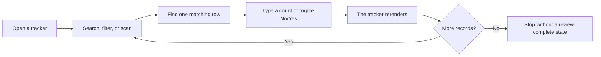
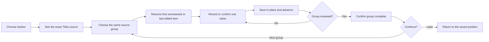

# Tracker Data Entry UX

## Decision

This document defines the tracker data-entry journey before any interface work resumes. It does not prescribe layout, spacing, typography, components, or visual styling.

The current tracker experience is not primarily a browsing problem. It is a repeated manual transcription problem: the player reads character data in Tibia, finds the matching record in this app, records it, and repeats that action dozens or hundreds of times.

## Product Definition

| Question | Answer |
|---|---|
| What is this product? | A character-progress ledger that turns manually recorded Tibia facts into reliable completion totals, dependencies, and planning inputs. |
| Who is it for? | A Tibia player maintaining Bestiary, Bosstiary, Charms, Achievements, Quests, Titles, and Cyclopedia Map progress for one character. |
| Why will they use it? | Tibia exposes these records in separate in-game surfaces. The player needs one dependable place to preserve progress and use it across the app. |
| What is the one key action? | Record or confirm the next item from the same in-game group, then advance without losing position. |

The primary success measure is not “the player opened a tracker.” It is:

> The player can complete a trustworthy manual review of one in-game group with minimal searching, no lost position, and a clear stopping point.

## Evidence Used

The current app was inspected without changing tracker data. The accepted screenshots are in [`docs/ux-audit/tracker-entry`](ux-audit/tracker-entry/).

1. [Bestiary](ux-audit/tracker-entry/01-bestiary-entry.png)
2. [Bosstiary](ux-audit/tracker-entry/02-bosstiary-entry.png)
3. [Charms](ux-audit/tracker-entry/03-charms-entry.png)
4. [Achievements](ux-audit/tracker-entry/04-achievements-entry.png)
5. [Quests](ux-audit/tracker-entry/05-quests-entry.png)
6. [Titles](ux-audit/tracker-entry/06-titles-entry.png)
7. [Measuring Tibia](ux-audit/tracker-entry/07-measuring-tibia-entry.png)

The in-game source map is grounded in official Tibia material:

- [Bestiary and Charms](https://www.tibia.com/news/?id=4351&subtopic=newsarchive)
- [Bosstiary](https://www.tibia.com/news/?id=6733&subtopic=newsarchive)
- [Quest Log](https://www.tibia.com/gameguides/?section=quests&subtopic=manual)
- [Achievements](https://www.tibia.com/library/?subtopic=achievements)
- [Cyclopedia Map discovery](https://www.tibia.com/news/?id=4668&subtopic=newsarchive)
- [Character Titles in the Cyclopedia](https://www.tibia.com/news/?id=7639&subtopic=newsarchive)
- [2026 discovery and Echo Warden changes](https://www.tibia.com/news/?id=8834&subtopic=newsarchive)

## Current Manual Entry Journey

Observed behavior shared by the trackers:

1. Every tracker opens as a complete catalog, not as a guided data-entry pass.
2. The player must decide where the data comes from and how the game list corresponds to the site list.
3. Numeric inputs save on focus loss. Enter blurs the field, rerenders the tracker, and restores focus to the same field instead of advancing.
4. Boolean controls save immediately, rerender the tracker, and do not restore the exact working position.
5. Search, filters, sort, paging, and the selected row are temporary view state. The page index is reset when changing trackers.
6. Numeric `0` and boolean `No` are defaults. Default records are removed from storage, so the app cannot distinguish “the player confirmed zero/no” from “the player never reviewed this item.”
7. Because unknown and zero/no are the same state, the app cannot say whether manual setup is complete.
8. Import appears after the catalog. CSV import mainly expects the format the tracker itself exports. Only Bestiary and Bosstiary also accept the supported JSON shape.
9. Import replaces the tracker record after a confirmation; it is not a review-and-merge journey.

## Source-to-Site Map

| Tracker | Where the player reads the truth | Game grouping to preserve | Data the player must record | Current repetition and failure |
|---|---|---|---|---|
| Bestiary | Cyclopedia → Bestiary | Creature class, then creature | Exact total kills; Echo Warden defeated; Animus Mastery | 833 rows. The player repeatedly searches or selects a class, types a count, and toggles flags. `0` looks recorded even when untouched. Enter returns to the same field. Animus Mastery is not in the main row, so one pass cannot record all Bestiary-owned facts. Echo Warden shows its points as the control label, which does not clearly communicate recorded yes/no state. |
| Bosstiary | Cyclopedia → Bosstiary | Bane, Archfoe, Nemesis | Exact boss kills | 316 rows. The app has category filters, but the work still begins in an all-boss alphabetical catalog. `0` is indistinguishable from unreviewed. Repeated numeric entry does not advance. |
| Charms | Cyclopedia charm information | Major, Minor | Current stage 0–3 for each charm | Only 25 rows, but stage is presented as a free numeric field. The app accepts any typing flow first and clamps later. The player has no explicit “this charm was checked” state when it is stage 0. |
| Achievements | Cyclopedia → Character Information → Achievements; the official website lists common achievements | The same category or order the player is using in Tibia | Earned yes/no for non-derived achievements | 570 rows with many categories and secret entries. Every untouched achievement already says `No`, so a new character appears fully reviewed. Measuring Tibia-derived achievements and manually editable achievements coexist, which changes the action from row to row. |
| Quests | Tibia Quest Log for logged questlines and missions | Questline → mission/status | Completed yes/no | The app mixes Quest Log entries with one-time treasure quests. Official Tibia documentation states that one-time treasure quests are not listed in the Quest Log, so the tracker cannot be completed from one in-game source. The app currently gives no source distinction and treats all 237 rows as equivalent. |
| Titles | Cyclopedia → Character Information → Character Titles | Permanent and losable titles; current character title list | Current availability/unlock state | 113 rows. Untouched already means `No`. “Earned” is also semantically wrong for losable titles: the useful truth is whether the character currently has the title, not only whether it was held historically. |
| Measuring Tibia | Cyclopedia Map → area → subarea discovery | Area, then subarea | Fully discovered yes/no | 171 rows. This tracker most closely matches its source because it is grouped by area, but it still starts as one catalog and cannot distinguish confirmed undiscovered from never reviewed. In current Tibia, subareas activate automatically and the client confirms completion, so the manual action should mirror that confirmation. |

## The Core Data Model Failure

Manual entry needs three truth states, not two:

| State | Meaning | May calculations trust it? |
|---|---|---|
| Not reviewed | The player has not checked this item in Tibia | No |
| Confirmed zero/no | The player checked it and the actual value is zero/no | Yes |
| Confirmed progress/yes | The player checked it and recorded progress/yes | Yes |

The current storage model removes entries that equal their defaults. As a result, `Not reviewed` collapses into `0` or `No`. No interaction polish can solve the manual-entry problem while that ambiguity remains.

The minimum state required for usable UX is progress plus review provenance, for example:

- value: kills, stage, or boolean;
- reviewed state or `reviewedAt`;
- last working group and item for resume.

This is not a new tracker or a new product mode. It is the state necessary to tell whether the user has actually entered the data.

## Target Manual Entry Journey

### 1. Enter with a source, not a database

The tracker identifies the exact in-game surface before asking for values. The player should never have to infer whether the source is Bestiary, Bosstiary, Character Information, Quest Log, or Cyclopedia Map.

### 2. Match Tibia's grouping

The player chooses the same group currently open in Tibia. The app begins with that group, not with “All.” This reduces repeated cross-searching between two differently ordered lists.

### 3. Start at a meaningful row

The default starting point is:

1. the last unfinished row in the last active group;
2. otherwise the first not-reviewed row in the chosen group;
3. otherwise the first row when intentionally reviewing the group again.

### 4. Use one continuous entry loop

For every row:

1. read the current value in Tibia;
2. record or confirm it in the app;
3. save without replacing the working list;
4. advance to the next row;
5. keep the same group, scroll position, and keyboard focus.

The app must treat `0` and `No` as valid confirmed values only after the player explicitly records or confirms them.

### 5. Finish a review, not the collection

“Group reviewed” means every item in the source group has been checked in this pass. It does not mean every Bestiary creature is complete or every achievement is earned.

At the end of the group, the player sees what was reviewed, what changed, and whether any records were skipped. The next action is either the next source group or stop and resume later.

### 6. Resume exactly

Leaving for Tibia, switching trackers, closing the tab, or opening supporting information must preserve:

- tracker;
- source group;
- review state;
- current row;
- sort/order used for the pass;
- scroll position;
- any valid unsaved draft.

## Working Story

Rafa keeps Tibia open beside the site. In the client, he opens Cyclopedia → Bestiary → Dragon. The site identifies that same source and resumes the first Dragon-class creature he has not reviewed. Rafa reads each total-kill value, enters it, and presses Enter. The value saves without moving the list, and the next creature is ready immediately. A real zero is saved as confirmed zero instead of remaining “unknown.” Eligible Echo Warden and Animus Mastery facts are confirmed in the same creature pass. When the class ends, Rafa sees that every Dragon entry was reviewed, what changed, and whether anything was skipped. He can continue to the next class or stop; returning later restores the same tracker, group, and row.

The other trackers reuse this exact story. Only the source group and the value being confirmed change.

## Tracker-Specific Variations

The journey stays the same. Only the source group and progress control change.

| Tracker | Source group | Row action | End of group |
|---|---|---|---|
| Bestiary | Creature class | Enter exact kills, then confirm Echo Warden and Animus Mastery when applicable | Every creature in the class has been reviewed; skipped flags remain named |
| Bosstiary | Bane, Archfoe, or Nemesis | Enter exact boss kills | Every boss in the category has been reviewed |
| Charms | Major or Minor | Choose stage 0, 1, 2, or 3 | Every charm of the type has been reviewed |
| Achievements | The category/order being checked in Character Information | Confirm earned or not earned; derived rows explain their source and are not manually changed | Every manually owned achievement in the group has been reviewed |
| Quests | Quest Log entry, or clearly labelled unlogged one-time quest group | Confirm completed or open using the named source | Every row that can be checked from that source has been reviewed |
| Titles | Permanent or losable | Permanent: confirm unlocked. Losable: confirm available now | Every title in the group has been reviewed with the correct meaning |
| Measuring Tibia | Area | Confirm each subarea as discovered or undiscovered | Every subarea in the area has been reviewed; area completion and achievement remain derived |

## Consistency Contract

Every tracker must obey the same behavioral rules:

1. The main task is named consistently: **Update progress**.
2. The source is always named before entry begins.
3. The app uses the source's grouping and order during an update pass.
4. There is exactly one progress action per row, plus only the domain-specific Bestiary flags that belong to that row.
5. Save is immediate, visible, and non-disruptive.
6. Enter or the primary keyboard action advances to the next editable row.
7. Boolean confirmation advances just like numeric confirmation.
8. The tracker never jumps to the top, changes group, or loses focus after saving.
9. `Not reviewed` is never displayed or calculated as confirmed `0`/`No`.
10. The player can leave and resume at the same row.
11. A review has a clear end and reports skipped records.
12. Import is a secondary entry method and follows the same trust model: preview, unmatched records, merge or explicit replace, then review completion.

## Prioritized UX Changes

### P0 — Required before visual redesign

1. Separate not-reviewed from confirmed zero/no in tracker state.
2. Define and preserve a source group for every manual entry pass.
3. Replace save-and-rerender with save-in-place and advance.
4. Persist the exact resume position for every tracker.
5. Give every tracker the same start, repeat, finish, and resume behavior.
6. Correct tracker-specific semantics: all Bestiary-owned fields in one pass, Quests split by source compatibility, losable Titles as current availability, and derived Achievements as non-manual facts.

### P1 — Trust and recovery

1. Show a lightweight saved/changed confirmation without interrupting entry.
2. Let the player undo the last row change without leaving the pass.
3. End each group with reviewed, changed, unchanged, and skipped counts.
4. Make import preview and merge the safe default; keep replace explicit.

### Not part of this UX correction

- no new tracker;
- no new dashboard;
- no objective or recommendation feature;
- no visual restyling;
- no automatic game-account sync;
- no login or database requirement.

## Acceptance Scenarios

### A1 — Confirmed zero is real data

- **Given:** Dragon has never been reviewed in the app.
- **When:** the player checks Tibia, records `0`, and advances.
- **Then:** Dragon becomes confirmed zero, not unreviewed, and the next creature receives focus.

### A2 — Continuous Bestiary transcription

- **Given:** the player has the same Bestiary class open in Tibia and the app.
- **When:** they enter 30 consecutive kill counts using the keyboard.
- **Then:** every value saves once, the list does not rerender or jump, and focus advances through the same class in source order.

### A3 — Continuous boolean transcription

- **Given:** the player is reviewing one Achievement category, Quest Log group, Title group, or map area.
- **When:** they confirm yes or no for consecutive rows.
- **Then:** each result saves and advances identically; confirmed no is distinct from not reviewed.

### A4 — Resume after interruption

- **Given:** the player stops halfway through a Bosstiary category.
- **When:** they return after switching trackers or reopening the app.
- **Then:** the same category, row, review progress, and position are restored.

### A5 — Honest Quests completion

- **Given:** a quest is absent from Tibia's Quest Log because it is a one-time treasure quest.
- **When:** the player reviews Quests.
- **Then:** the app does not imply that the Quest Log can verify it; the correct alternate source group is named.

### A6 — Honest losable Title state

- **Given:** a title can be lost.
- **When:** the player reviews it.
- **Then:** the recorded fact means “available now,” while permanent titles mean “unlocked.”

### A7 — Review completion

- **Given:** a group contains real zero/no values.
- **When:** every row has been explicitly checked.
- **Then:** the group can be marked reviewed without falsely marking the collection complete.

### A8 — Safe import

- **Given:** the player already has manual progress.
- **When:** they import another tracker file.
- **Then:** the app previews matches, conflicts, and unmatched rows; merge is available without silently replacing unrelated manual data.

## Audit Health by Step

| Step | Current health | Reason |
|---|---|---|
| Find the source in Tibia | Poor | The site does not name a concrete source path for the current tracker pass. |
| Match the source group | Weak | Some equivalent filters exist, but every tracker begins as an all-record catalog and ordering is not defined as source order. |
| Find the next record | Poor | The user repeatedly searches or scans; there is no first-unreviewed or resume position. |
| Record a value | Weak | Controls exist and autosave, but zero/no is ambiguous and Bestiary-owned flags are split across contexts. |
| Continue to the next record | Poor | Numeric Enter returns to the same field; boolean saves rerender without equivalent focus restoration. |
| Know the pass is complete | Broken | The app cannot distinguish reviewed defaults from untouched records. |
| Resume later | Poor | Progress values persist, but the working group, row, page, and position do not form a resumable entry pass. |

## Accessibility and Evidence Limits

- The DOM provides row-specific accessible names for count and boolean controls, which is a useful baseline.
- The current full rerender after a boolean change creates a keyboard-focus risk. The numeric path deliberately restores focus to the same input, which prevents a continuous keyboard sequence.
- Assistive technology receives default `0` and `No` as if they were recorded facts; it has no state that communicates “not reviewed.”
- Screenshot inspection cannot prove full keyboard, screen-reader, or focus-order behavior. Interaction behavior above is additionally grounded in the tracker event handlers.
- The Tibia client itself was not available for screenshot capture. In-game source mapping is therefore based on official Tibia documentation, while the app-side journey is based on the captured local product and its current code.
