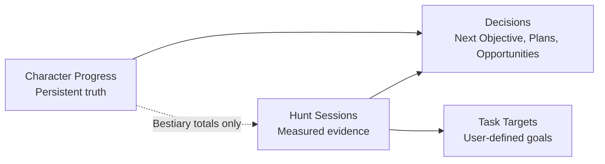
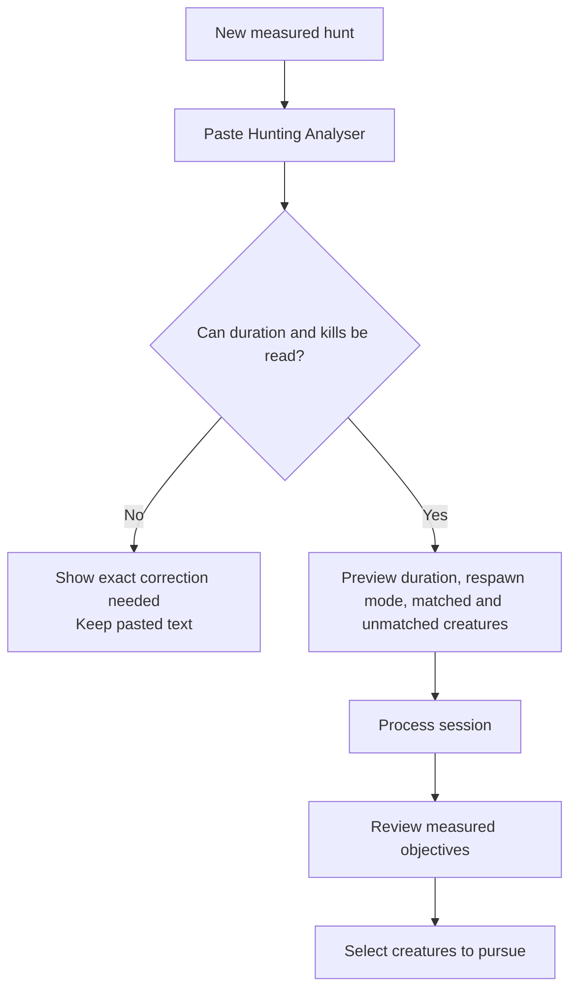

# Complete UX Architecture

## Purpose

This document defines the experience before visual design. It covers every shipped tracker, Bestiary-session calculation, Task Session, data operation, shared interaction, and responsive state.

The visual concepts generated before this document are not implementation specifications. Visual selection stays paused until this UX architecture is accepted.

## Domain Model

The interface must teach the product model through behavior, not through explanatory copy alone.

### Ownership rules

| Information | Owner | Read by | Never owned by |
|---|---|---|---|
| Bestiary total kills | Character Progress | Hunts, Plans, Opportunities | An individual session |
| Echo Warden / Animus Mastery | Character Progress | Recommendations and creature detail | Hunt Analyzer |
| Session duration and kills | Hunt Session | Session estimate, Plans, Tasks | Character Progress |
| Respawn mode | Hunt Session | Charm Plan and session context | Bestiary creature |
| Task target | Task Estimate for one session | Task overview | Bestiary or Charm Plan |
| Available play time | Charm Plan | Current plan result | Session Library |
| Spawn availability | Current Charm Plan | Current plan result | Session archive |
| Name, date, notes | Hunt Session | Library, compare, evidence labels | Tracker progress |

Any screen that edits or displays these values must label their owner consistently.

## Global UX Structure

### Primary navigation

1. **Next Objective**
2. **Character Progress**
3. **Bestiary Hunts**
4. **Plans**
5. **Task Estimates**

Secondary utilities:

- Search
- Data and backup
- About / data sources

### Navigation behavior

- One top-level destination is selected at a time.
- Subnavigation appears only for the selected destination.
- Long session lists never become horizontal page tabs. Use a session list or switcher with search.
- The browser back/forward model should reflect destination and selected object.
- Returning to a destination restores its last local state: tracker, filter, session, or plan mode.
- Mobile uses the same destination names; it must not invent a different information architecture.

### Page hierarchy

Every screen follows this order:

1. Destination and object name.
2. One-sentence task description only when needed.
3. One primary action.
4. The answer or current state.
5. Controls that change that answer.
6. Supporting details.

No page may place data import, export, sorting, filtering, creation, and destructive actions at the same visual level.

### Global search

Search is a cross-product jump tool, not a duplicate page:

- Searches creatures, bosses, charms, achievements, quests, titles, areas, subareas, sessions, and plans.
- Results are grouped by domain.
- Each result states where it will lead.
- Recent objects appear before typing.
- `/` focuses search on desktop; Escape closes it and returns focus.

## Capability Coverage Map

This map is the audit boundary for the redesign. A capability is not considered designed unless its entry point, owning object, primary action, and successful next state are all explicit.

| Capability | Primary destination | Owning object | One primary action | Successful next state |
|---|---|---|---|---|
| Bestiary Tracker | Character Progress | Creature progress | Update kills | Updated stage, remaining kills, rewards, and dependent decisions |
| Bosstiary Tracker | Character Progress | Boss progress | Record boss kills | Updated boss stage and Boss Points |
| Charms Tracker | Character Progress | Charm ownership | Set charm stage | Updated stage and separated currency balance |
| Achievements Tracker | Character Progress | Achievement progress | Mark earned | Updated completion and achievement points |
| Quests Tracker | Character Progress | Quest progress | Mark completed | Updated quest completion and related filters |
| Titles Tracker | Character Progress | Title ownership | Mark earned | Updated current title ownership |
| Measuring Tibia Tracker | Character Progress | Area discovery | Mark subarea discovered | Updated area completion, reward context, and derived achievement |
| Bestiary Session Capture | Bestiary Hunts | Hunt session | Process Hunting Analyser | Validated measured hunt with matched and unmatched creatures |
| Bestiary Session Estimate | Bestiary Hunts | Session/creature evidence | Choose objectives | Selected objectives with measured completion estimates |
| Bestiary Sessions Overview | Bestiary Hunts | Evidence pair | Choose representative session | One explicit evidence source per planned objective |
| Session Comparison | Plans, linked from Hunts | Comparison state | Open strongest session | Source hunt opened with comparison context preserved |
| Charm Plan | Plans | Current charm plan | Enter available play time | Ordered feasible route with reward and time explanation |
| Opportunities | Plans | Recommendation set | Open recommendation | Relevant progress, location, or measured session opened |
| Session Library | Bestiary Hunts | Hunt session | Reopen stored session | Session restored with its evidence and selections intact |
| Task Session | Task Estimates | Task estimate | Enter task target | Remaining kills and time calculated from named evidence |
| Data and Backup | Data | Tracker or workspace payload | Import progress or create backup | Previewed data committed safely or downloadable backup created |

### Transition contract

Every successful action leads somewhere meaningful:

- Progress updates remain in context, show the changed consequence, and refresh dependent recommendations without navigating unexpectedly.
- Hunt processing moves from raw text to a reviewable measured session; it never jumps directly to a recommendation before the player verifies the evidence.
- Planning actions open the exact progress item or hunt session supporting the answer and preserve the plan when the player returns.
- Data operations end with a verifiable summary: records changed, records unchanged, unmatched records, and the available recovery action.
- Empty and error states keep the user's input and provide the shortest action that can unblock the current task.

## Next Objective

### Purpose

This is the default entry point and the only screen whose job is to recommend what to do next.

### First-use state

If neither progress nor processed sessions exist:

1. Explain that recommendations need character progress and measured hunt evidence.
2. Primary action: **Import Bestiary progress**.
3. Secondary action: **Create a measured hunt**.
4. Allow manual progress entry without forcing import.

If progress exists but no sessions exist:

- Recommend a progress-based quick win or location.
- Clearly label time as unavailable.
- Primary action: **Measure a hunt**.

If sessions exist but Bestiary progress is empty:

- Show what the session measured.
- Do not pretend zero kills is confirmed character truth.
- Primary action: **Add character progress**.

### Recommendation state

The recommendation contains:

- Objective name.
- Why it is recommended.
- Remaining work.
- Reward.
- Estimated time when evidence exists.
- Character-progress source.
- Measured-session source.
- One primary action: **Open hunt plan** or **Open session**, depending on the recommendation.

Alternatives are a short ordered list. They never compete visually with the primary objective.

### Trust and correction

- Each input value links to its owner.
- The player can dismiss an unsuitable objective and state why: unavailable spawn, not interested, team requirement, or temporary skip.
- A dismissed objective remains recoverable in preferences.
- Recommendation changes announce what changed, not merely that a refresh occurred.

## Character Progress

### Collection landing

The collection selector contains:

- Bestiary
- Bosstiary
- Charms
- Achievements
- Quests
- Titles
- Measuring Tibia

Each collection shows completion and the metric meaningful to that collection. It does not show unrelated statistics.

### Shared tracker anatomy

1. Collection title and completion summary.
2. Primary action: update the collection's progress.
3. Search and collection-specific filters.
4. Result count and active-filter summary.
5. Sortable result list or table.
6. Selected-item detail.
7. Secondary data actions: import and export.

### Shared tracker behavior

- Editing autosaves locally.
- The changed value receives a brief saved confirmation without moving focus.
- Search and filters update immediately and preserve keyboard focus.
- Active filters are visible and removable individually; **Clear all** appears only when needed.
- Sorting announces direction and stays stable across edits.
- Pagination does not reset selection silently.
- Opening detail never hides the edited row without a clear return path.
- Bookmarks mean “candidate objective,” not “favorite.” Copy and tooltips use that meaning.
- Bulk import previews matched, changed, unchanged, and unmatched rows before replacement.

### Bestiary UX

Primary action: **Update kills** or **Import Bestiary progress** when empty.

Row essentials:

- Creature
- Current kills / completion target
- Stage
- Remaining kills
- Charm Points
- Echo Warden status when eligible
- Candidate-objective bookmark

Detail essentials:

- Full progress and threshold.
- Locations and class.
- Echo Warden and Animus Mastery ownership.
- Sessions containing the creature, with measured rates.
- Action to open the strongest measured session.

Rules:

- “Session kills” and “total Bestiary kills” never share the same label.
- An empty kills field means unrecorded unless the player explicitly sets zero.
- Completion prevents accidental values above the target but retains imported truth if game data changes.

### Bosstiary UX

Primary action: **Record boss kills**.

Hierarchy:

- Category and cooldown meaning.
- Current stage: none, Prowess, Expertise, Mastery.
- Kills to next stage.
- Boss Points earned.
- Boosted-boss relevance when current data is available; never fake live status from static data.

The stage explanation remains accessible in detail, not repeated in every row.

### Charms UX

Primary action: **Set charm stage**.

Hierarchy:

- Major versus minor.
- Current stage 0–3.
- Currency already spent.
- Next-stage cost.
- Total available Charm Points and Minor Charm Echoes shown separately.

Changing a stage previews the currency effect before saving when it would make available currency negative. The product never merges both currencies into one “points” value.

### Achievements UX

Primary action: **Mark earned**.

Hierarchy:

- Name and earned state.
- How to earn it.
- Grade and points.
- Category, rarity, and secret status as filters.

Achievements derived from Measuring Tibia are read-only here and link back to the responsible area. The interface explains why the toggle is unavailable.

### Quests UX

Primary action: **Mark completed**.

Hierarchy:

- Quest name and completion.
- Questlog group.
- Rewards.

Search includes quest, questlog, and rewards. Spoiler-heavy content is not expanded by default; the player chooses to reveal details.

### Titles UX

Primary action: **Mark earned**.

Hierarchy:

- Title.
- Requirement.
- Permanent or losable.
- Earned state.

Losable titles explain that “earned” records current ownership, not historical discovery.

### Measuring Tibia UX

Primary action: **Mark subarea discovered**.

Hierarchy:

- Area completion first.
- Subareas nested inside the area.
- Bestiary creatures associated with the selected subarea.
- Area achievement and speed-reward context.

The 2026 system behavior is reflected: subareas are automatically active in Tibia, so this product does not ask the user to “start” discovery.

## Bestiary Hunts

### Hunts landing

The landing page is a session library optimized for reopening evidence:

- Primary action: **New measured hunt**.
- Recent sessions first.
- Search by name, notes, creature, date, and respawn mode.
- Each row shows duration, respawn mode, creature count, and whether processing succeeded.
- Compare is available only after at least two valid Bestiary analyses exist.

### Create-session flow

### Paste and validation

- The paste area is the only dominant control in the empty session.
- Clipboard paste is a convenience, never a requirement.
- Regular Respawn is not silently assumed; the default is visible before processing.
- Validation preserves the full text and points to missing duration or missing killed-monster data.
- Unmatched creatures are listed before processing and can be copied for data-quality reporting.

### Processed session

Header:

- Session name.
- Hunt date.
- Respawn mode.
- Duration.
- Status: processed or needs attention.

Primary action: **Choose objectives**.

For each creature:

- Session kills.
- Measured kill rate.
- Character-wide Bestiary kills.
- Remaining kills.
- Estimated completion time.
- Charm reward and effective charm rate.
- Selection state for planning.

The two kill values are separated visually and linguistically. Editing character-wide kills updates the Bestiary tracker and every dependent calculation.

### Session management

- Rename, date, and notes autosave.
- Clearing analysis keeps name, date, notes, and respawn mode.
- Deleting uses a recoverable archive/undo interaction rather than an irreversible browser confirm.
- Session switching uses a searchable switcher or library list; it never creates an unbounded tab strip.

### Bestiary Sessions overview

- One row per session/creature evidence pair.
- Duplicate creatures remain separate when rates differ.
- The player explicitly chooses which evidence pair represents an objective in planning.
- Summary totals explain sequential time across sessions and simultaneous creature progress inside one session.
- Editing character progress links back to the single Bestiary owner.

### Session comparison

Primary action: **Open strongest session**.

Comparison uses:

- Total selected Charm Points.
- Longest completion time within the session.
- Effective Charm Points per hour.
- Respawn mode.
- Number of selected objectives.

The best result is stated in plain language. Sorting and raw metrics support the answer rather than replace it.

## Plans

### Plans landing

Plans contains three decision tools:

1. Charm Plan
2. Opportunities
3. Compare Sessions

Each tool states its required inputs before opening.

### Charm Plan

Empty state:

- If no sessions exist: **Create measured hunt**.
- If no eligible session exists for the selected respawn mode: show the exact exclusion reason.
- If play time is missing: focus **Play time available**.

Input hierarchy:

1. Play time available.
2. Planned respawn mode.
3. Sessions considered, with available / unavailable / wrong mode.

Result hierarchy:

1. Charm Points obtainable.
2. Time used and unused.
3. Completed Bestiary entries.
4. Recommended route in order.
5. Explanation of simultaneous progress inside a session.

Primary action: **Open first route step**.

Changing time, mode, or availability recalculates in place and announces the new result.

### Opportunities

Primary action: **Open recommendation**.

Order:

1. Finishable now — measured and actionable.
2. Quick wins — progress close to completion.
3. Where to go — locations ranked by unclaimed points.
4. Started and dropped — progress without current measured evidence.

Every row explains whether its estimate comes from measured evidence or progress only. Missing evidence never receives a fabricated time.

### Compare Sessions

The comparison is accessible from Plans and Hunts, but it is one screen with one state. It never appears as a duplicate implementation.

## Task Estimates

### Tasks landing

- Primary action: **Create task estimate**.
- Shows processed sessions and their current task creature/target.
- Does not show Bestiary Charm Points, Charm Plan, or Bestiary completion language.

### Task flow

1. Choose an existing processed session or paste a new analyser.
2. Choose one creature measured in that session.
3. Enter the user-defined total target.
4. See session kills, measured hourly rate, kills remaining, and estimated time.
5. Open the source session when the evidence needs correction.

Validation:

- Target must be a non-negative whole number.
- A target below session kills produces zero remaining and states that the target was already met during the measured session.
- A session without duration cannot produce time; the product shows the kill count but not a fake estimate.

## Data and Backup

### Tracker import

1. Choose file.
2. Validate format.
3. Preview matched, changed, unchanged, and unmatched records.
4. Confirm replacement of that tracker only.
5. Show a persistent result summary with a downloadable unmatched list when needed.

Reference-game thresholds, categories, points, and descriptions are never imported from user files.

### Tracker export

- Export reflects the active tracker and active character-progress values.
- The filename includes tracker and date.
- Completion feedback states record count and file name.

### Workspace backup

- Export includes progress, sessions, notes, selections, plan constraints, and current navigation state.
- Import previews session count and tracked-record counts before replacing anything.
- Failed import leaves current data unchanged.
- Successful import offers one-step undo until the next edit.

## Shared Interaction System

### Action priority

- One primary action per screen.
- Secondary actions are text or neutral buttons.
- Destructive actions live in object menus or danger zones, never beside the primary action.
- Disabled controls explain what requirement is missing.

### Feedback

- Autosave: subtle inline “Saved” state.
- Completed action: toast plus screen-reader live announcement.
- Recoverable deletion: toast with Undo.
- Blocking validation: inline message beside the field and a summary focused at submit.
- Background recalculation: no spinner unless it exceeds 300 ms; preserve the previous answer until the new one is ready.

### Forms

- Labels are persistent; placeholders show examples only.
- Units are visible beside numeric inputs.
- Enter commits single-value edits; Escape restores the previous value.
- Dirty fields do not rerender underneath the user's focus.
- Imported zero, explicit zero, and unknown are distinct states where the domain needs that distinction.

### Tables and lists

- Desktop tables keep headers visible during vertical scroll.
- The identifying first column stays visible during horizontal scroll.
- A row click opens detail; embedded controls do only their own action.
- Numeric columns align consistently and use tabular numerals.
- Mobile uses purpose-built stacked rows showing the three most decision-critical values; it does not merely crop the desktop table.
- Additional columns are available in the full-screen mobile detail.

### Detail behavior

- Desktop: contextual inspector when space allows.
- Narrow desktop/tablet: overlay inspector with background retained.
- Mobile: full-screen detail with explicit back navigation.
- Closing detail returns focus to the row that opened it.

## Responsive UX

### Desktop, 1200 px and wider

- Persistent primary navigation.
- Main task surface.
- Optional contextual inspector.
- Filters remain on one or two intentional rows, never squeezed into unreadable widths.

### Tablet, 768–1199 px

- Collapsible navigation.
- Full-width task surface.
- Inspector overlays instead of shrinking data below a usable measure.

### Mobile, below 768 px

- Compact destination navigation with labels, not icon-only guessing.
- Screen title and primary action remain visible without horizontal scrolling.
- Filters open in a sheet and summarize active state when closed.
- Tables become task-specific rows.
- Primary bottom action may become sticky only when it remains relevant during scroll.
- Minimum touch target: 44 × 44 px.

## Accessibility Contract

- One `h1` per screen with logical nested headings.
- Every control has a visible label or accessible name matching its visible purpose.
- Selected, completed, warning, and unavailable states never rely on color alone.
- Keyboard order follows the visual task order.
- Focus is always visible and restored after dialogs, sheets, and detail panels close.
- Status changes use a polite live region; blocking errors use assertive announcement only when necessary.
- Tables retain semantic headers and sort state.
- Dialogs trap focus and close with Escape when safe.
- Reduced-motion preference removes decorative transitions without removing state feedback.
- Text and controls meet WCAG AA contrast; body copy does not fall below 14 px on desktop or mobile.

## Error, Empty, and Recovery Matrix

| Surface | Empty state action | Recoverable error | Destructive recovery |
|---|---|---|---|
| Next Objective | Add progress or a hunt | Explain missing truth/evidence | Restore dismissed objective |
| Tracker | Import or update first entry | Preserve filters and edit | Undo bulk replacement |
| Hunt session | Paste analyser | Keep text and identify parse issue | Undo archive/delete |
| Charm Plan | Add time/session eligibility | Preserve last valid plan | Restore ignored session |
| Opportunities | Add progress or session evidence | Identify missing evidence | Restore skipped objective |
| Compare | Process a second session | Exclude invalid session with reason | Re-include session |
| Task Estimate | Select session and creature | Keep target and show missing duration | Restore cleared target |
| Data import | Choose valid file | Leave current workspace untouched | Undo successful replacement |

## Cross-Feature Validation Checklist

- Bestiary edits refresh every session, plan, opportunity, and Next Objective that reads them.
- Non-Bestiary trackers do not alter session maths.
- Measuring Tibia-derived achievements cannot create conflicting manual state.
- Session respawn mode affects Charm Plan eligibility but not Task estimates or archive visibility.
- Session availability affects the current Charm Plan only.
- Task targets never alter Bestiary totals or Charm Points.
- Deleting a session removes its evidence from comparison and plans but never deletes character progress.
- Importing one tracker never replaces another tracker or any session.
- Whole-workspace import previews and replaces the complete workspace atomically.
- Search can reach every object without duplicating its source of truth.

## UX Acceptance Gate Before Visual Design

Visual design may resume only when all of the following are true:

- Every shipped capability maps to one primary destination and one owning object.
- Every screen has one primary action.
- First-use, populated, empty, validation, success, and destructive states are defined.
- Character truth, hunt evidence, and calculated decisions cannot be confused.
- Desktop and mobile interaction models are both specified.
- No required feature depends on an unbounded tab strip or a desktop table cropped on mobile.
- Cross-feature updates and deletion/import consequences are explicit.
