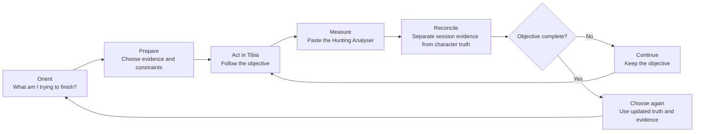
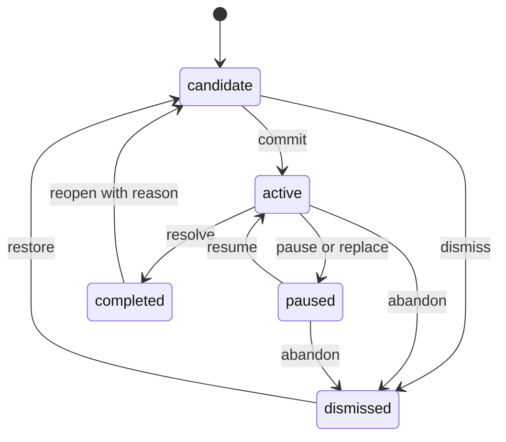
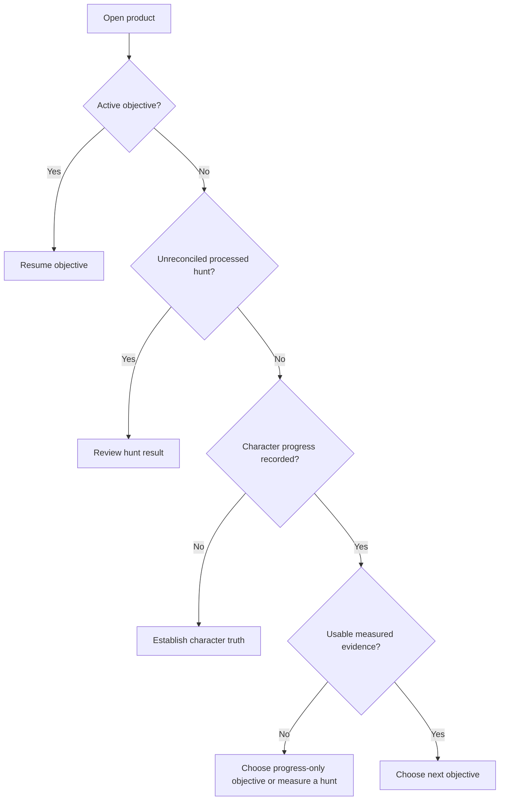
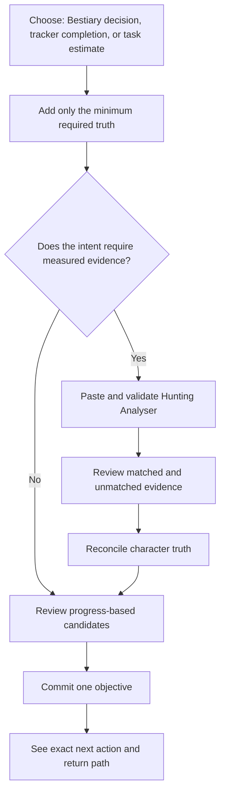
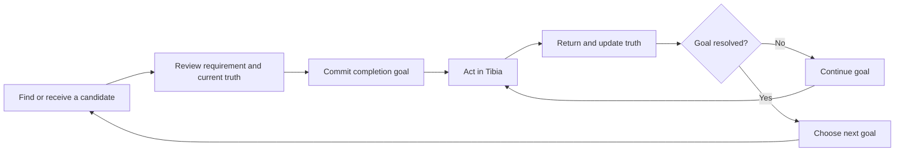

# UX Journey System

The testable Given/When/Then contract for this model is defined in [UX Journey Acceptance Scenarios](ux-scenario-suite.md).

## Scope

This is the governing UX model for the product. It changes no layout, styling, component, or UI implementation. Its purpose is to define how users move between capabilities, how context survives those moves, and how every action closes or advances a real task.

The application is not seven trackers plus several session tools. It is one recurring player loop supported by several records and calculations.

## The Product Loop

The product's main job is:

> Help a Tibia player choose a worthwhile objective, act on it in the game, measure what happened, update the truth, and make the next decision with better evidence.

The external hunt is a deliberate part of the journey. The product must preserve the active objective while the player leaves the app, plays Tibia, and returns later.

## UX North Star

At any moment, the player should be able to answer five questions:

1. What am I trying to accomplish?
2. What information supports this recommendation or estimate?
3. What should I do next?
4. What changed after my last action?
5. How do I return to the decision I was making?

If any state cannot answer these questions, the flow is incomplete.

## User Intents, Not Product Modules

The product recognizes these entry intents:

| Intent | User's question | Completion condition |
|---|---|---|
| Resume an objective | What was I working on? | Supporting hunt or progress item is open with context intact |
| Choose a Bestiary objective | What should I hunt next? | One creature or multi-creature hunt is committed as the active objective |
| Record a hunt | What did this hunt teach me? | Valid evidence is saved and reconciled with character truth |
| Maintain character progress | What is my current completion state? | The intended record is updated and consequences are known |
| Plan a play window | What can I finish with the time I have? | A feasible route is committed or explicitly rejected |
| Estimate a killing task | How long will this target take? | A target is linked to measured evidence and has a usable estimate |
| Review history | Which past evidence should I trust or reuse? | A session is opened, corrected, compared, archived, or restored |
| Protect or move data | Can I trust this import or backup? | The result is verified and recoverable |

Navigation can expose product areas, but journey decisions must be phrased and routed by these intents.

## Governing Objects

### Character progress

Persistent truth owned by a tracker entry. A creature's total Bestiary kills can be edited from several contexts, but there is only one stored value.

States:

- `unknown` — the player has not recorded a value.
- `recorded-zero` — the player explicitly confirmed zero.
- `in-progress` — progress is above zero and below completion.
- `complete` — completion threshold reached.
- `needs-review` — imported or derived state conflicts with a current rule.

Unknown must never be calculated as confirmed zero in recommendations.

### Hunt session

Evidence copied from one Hunting Analyser. It owns raw text, duration, killed creatures, date, respawn mode, name, and notes.

States:

- `draft` — raw text exists but has not been processed.
- `invalid` — processing failed and exact corrections are known.
- `valid` — duration and at least one creature were parsed.
- `partially-matched` — valid evidence contains unmatched creature names.
- `cleared` — analysis removed while archive metadata remains.
- `archived` — removed from active use but recoverable.

A session never owns character-wide kills, an active objective, or plan eligibility.

### Evidence link

The relationship between a creature and a measured session. It owns measured session kills and the calculated rate for that creature in that session.

States:

- `available` — valid rate can support decisions.
- `incomplete` — creature exists but duration or count is unusable.
- `preferred` — the player or recommendation currently uses this evidence source.
- `superseded` — retained historically but a stronger or newer source is preferred.

The same creature may have several evidence links. They must not be silently averaged or collapsed.

### Objective

A player commitment, not a bookmark and not a row selection.

It owns:

- objective type: creature, hunt, area, tracker item, or task;
- target object;
- supporting session when relevant;
- reason selected;
- created time;
- status;
- return destination.

States:

- `candidate`
- `active`
- `paused`
- `completed`
- `dismissed`

There is at most one active primary objective. Alternatives stay candidates.

Valid transitions:

- Committing a new primary objective pauses the previous active objective.
- Completing an objective records the truth update that resolved it; completion is not inferred only because a calculated estimate reached zero.
- Reopening a completed objective requires a reason such as losable ownership, changed game data, or corrected progress.
- Dismissal keeps provenance so the recommendation engine can explain why the candidate is not being shown.

### Charm plan

A calculated decision for a specific play-time budget, respawn mode, progress snapshot, and set of eligible sessions.

States:

- `blocked` — a required input is missing.
- `ready` — a result exists but no route is committed.
- `committed` — a first route step became the active objective.
- `outdated` — progress or evidence changed after calculation.
- `completed` — every committed route step was resolved.

### Task estimate

A separate goal referencing one evidence link. It owns creature, target, and task status. It does not live inside or mutate the hunt session.

States:

- `blocked`
- `ready`
- `active`
- `completed`
- `outdated`

## Journey Context Contract

Every cross-feature transition carries a context envelope:

| Field | Purpose |
|---|---|
| `intent` | The job the user is currently completing |
| `origin` | Where the transition began |
| `returnTo` | Where completion or cancellation returns |
| `objectiveId` | Active objective, when one exists |
| `sessionId` | Supporting hunt evidence |
| `trackerId` and `entryId` | Character truth being inspected or corrected |
| `planId` | Current decision snapshot |
| `taskId` | Current independent task estimate |
| `reason` | Why this object was opened from the previous step |

Rules:

- Opening supporting evidence never destroys the decision that requested it.
- Back returns to the previous task state, not merely the previous product area.
- Completing a correction returns to the requesting plan, objective, or estimate and shows the changed consequence.
- Cancel returns without applying changes and without losing draft input.
- A direct navigation choice ends the current subflow only after draft state is preserved.

## Entry-State Router

The default destination is derived from state rather than hard-coded to a tracker.

### Resume objective

Show the committed objective, expected reward, supporting evidence, and last known remaining work. Primary action: **Continue objective**. After returning from Tibia, the adjacent action is **Record latest hunt**.

### Review hunt result

Do not bury newly processed evidence in the session archive. Primary action: **Review what changed**. The player resolves unmatched creatures, confirms character-progress changes, and then chooses whether to continue or select a new objective.

### Establish character truth

The product offers two valid paths without pretending one is mandatory:

- Import the progress collection relevant to the current intent.
- Record a value manually.

The path returns to the intent that required the truth.

### Progress-only decision

When no measured evidence exists, recommendations may use remaining kills, rewards, locations, and bookmarks. Time and efficiency are explicitly unavailable. Primary action: **Choose objective** or **Measure this hunt** when the player wants rate evidence first.

## Core Journey 1: First Useful Outcome

Goal: leave the product with one trustworthy objective, not merely populated data.

Flow rules:

1. The first choice captures intent, not product knowledge.
2. The user is never asked to populate unrelated trackers.
3. Import and manual entry return to the unfinished journey.
4. A processed session is reviewed before it influences a recommendation.
5. The first outcome is a committed objective with a reason and next action.

Success: the player knows what to do in Tibia and what to record afterward.

## Core Journey 2: The Repeat Hunt Loop

Goal: make each new hunt improve both progress truth and future decisions.

1. Resume the active objective.
2. Open its supporting hunt evidence and constraints.
3. Leave to play Tibia; objective state persists.
4. Return and choose **Record latest hunt**.
5. Paste the new analyser into a new session by default; replacing old evidence requires an explicit choice.
6. Validate duration and killed-monster block.
7. Review matched, unmatched, and omitted creatures before saving.
8. Reconcile progress:
   - session kills remain session evidence;
   - total Bestiary kills remain character truth;
   - the player may update totals now or keep them unknown;
   - estimates using unknown totals are labeled accordingly.
9. Compare actual result with the active objective.
10. Resolve:
    - **Continue** if incomplete;
    - **Complete** if threshold reached;
    - **Change objective** if the evidence makes the current choice unsuitable.
11. The decision engine recalculates from the new evidence and truth.

The loop never ends on a table. It ends on one of the three resolution actions.

## Core Journey 3: Bestiary Decision

Goal: choose a creature or multi-creature hunt for a stated reason.

### Candidate sources

- Active bookmarks explicitly promoted to candidates.
- Finishable measured creatures.
- Progress-only quick wins.
- High-unclaimed-value locations.
- Started creatures with no measured evidence.
- Charm Plan route steps.
- Session comparison.

### Candidate actionability

Every candidate must have a next action:

| Candidate | Primary action | Next state |
|---|---|---|
| Finishable measured creature | Choose objective | Active objective linked to the measured session |
| Quick win without evidence | Choose objective | Progress-only objective; time remains unknown |
| Location | Review creatures | Ranked creatures in that location, retaining location context |
| Started without evidence | Measure hunt | New-session flow pre-associated with that creature |
| Charm Plan step | Commit route step | Active hunt objective linked to plan snapshot |
| Compared session | Choose session | Session-level objective with compared metrics retained |
| Bookmark | Review candidate | Candidate detail with available evidence and locations |

Recommendations without an action are informational reports, not UX-complete recommendations.

### Decision explanation

Each recommendation states:

- what is recommended;
- which reward or completion it advances;
- why it outranks alternatives;
- which character truth it used;
- which measured evidence it used;
- what is unknown;
- what would change the result.

### Commitment

Selecting a candidate does not merely open its detail. It creates an active objective. The player can pause, complete, dismiss, or replace it. Replacing an active objective explains that the previous objective will be paused, not deleted.

## Core Journey 4: Hunt Evidence Capture

Goal: transform copied text into trustworthy reusable evidence.

### Entry points

- Record latest hunt from an active objective.
- Measure this hunt from an unmeasured candidate.
- New measured hunt from the session library.
- New evidence from a Task Estimate.

The entry point supplies context and a return destination.

### Validation sequence

1. Capture raw text.
2. Parse session duration.
3. Parse the killed-monster block.
4. Match creature names against Bestiary data.
5. Present matched, unmatched, and ignored content.
6. Confirm recorded respawn mode.
7. Save evidence.
8. Continue to reconciliation.

Invalid input never clears raw text. Partially matched input can be saved only after the unmatched result is acknowledged.

### Reprocessing

Reprocessing existing evidence creates a revision. The previous parsed result remains recoverable until the revised result is accepted. Changing raw evidence invalidates calculations that depend on it and marks them `outdated`.

### Completion

Saving evidence is not the end. The next required step is reconciliation with the intent that opened capture.

## Core Journey 5: Reconciliation

Goal: ensure evidence and truth are never mistaken for one another.

For each matched creature, show the logical comparison:

| Value | Meaning | Owner |
|---|---|---|
| Killed this session | What the analyser measured | Hunt session |
| Previously recorded total | Last known character truth | Bestiary tracker |
| Proposed new total | Optional correction or import result | Pending reconciliation |
| Completion consequence | Stage, remaining kills, reward | Derived decision |

Rules:

- Session kills are not automatically added to character total; the Hunting Analyser is not proof of the prior total or whether the in-game total already includes those kills.
- The player may confirm a new total, leave it unchanged, or mark it unknown.
- Any changed total previews which objective, plan, comparison, or opportunity will change.
- Finishing reconciliation returns to the originating intent and summarizes the consequence.

## Core Journey 6: Charm Plan

Goal: commit a feasible route for a specific play window.

1. Enter play time.
2. Choose respawn conditions.
3. Review eligible sessions and explicit exclusion reasons.
4. Resolve missing or outdated inputs in place or through a contextual subflow.
5. Review the best route and at least one meaningful alternative when the result is close.
6. Open supporting evidence without losing the plan.
7. Return to the exact plan snapshot after inspection or correction.
8. Commit the first route step as the active objective.
9. After new evidence or progress, mark the plan outdated and offer recalculation.

Plan availability is a constraint on one plan snapshot. It does not modify or annotate the session archive globally.

No-result states explain which condition blocked a route:

- insufficient play time;
- no valid evidence;
- wrong respawn mode;
- all sessions excluded;
- selected creatures already complete;
- unknown progress prevents a completion estimate.

## Core Journey 7: Session Comparison

Goal: choose evidence or a hunt, not merely rank rows.

1. Enter with at least two valid comparable sessions.
2. State the comparison question: best efficiency, highest total reward, shortest completion, or newest evidence.
3. Rank using the selected question.
4. Explain why the leading session wins and where it loses.
5. Open any source session and preserve comparison state.
6. Choose a session as an objective or preferred evidence source.
7. Return to the origin: Bestiary decision, plan, or library.

Comparisons cannot mix Regular and Rapid Respawn as if conditions are equal. Mixed-mode comparison either groups results or requires the player to choose a mode.

## Core Journey 8: Character Progress

Goal: maintain truth and understand its consequences.

1. Enter from direct maintenance or a contextual correction.
2. Preserve the relevant collection, item, filter, and origin.
3. Update one value or complete an import preview.
4. Confirm saved state without moving focus.
5. Show the consequence when it affects another journey.
6. Contextual entry returns to the requesting objective, plan, or session.
7. Direct maintenance remains in the collection and offers the next nearby item.

Tracker-specific completion:

| Tracker | Successful action | Consequence |
|---|---|---|
| Bestiary | Total kills recorded | Stages, opportunities, plans, and estimates refresh |
| Bosstiary | Boss kills recorded | Stage and Boss Points refresh |
| Charms | Stage confirmed | Major or minor currency balance refreshes separately |
| Achievements | Earned state confirmed | Completion and achievement points refresh |
| Quests | Completion confirmed | Quest completion and related filters refresh |
| Titles | Current ownership confirmed | Completion reflects permanent or losable meaning |
| Measuring Tibia | Subarea discovery confirmed | Area completion and derived achievement refresh |

Bookmarks create decision candidates. If they do not appear in the decision journey, they have no valid UX purpose.

## Core Journey 9: Completion Goal Loop

Goal: turn any non-session tracker entry into a goal the player can resume and resolve.

This loop covers Bosstiary, Charms, Achievements, Quests, Titles, and Measuring Tibia. These collections do not require Hunting Analyser evidence, but they still need an intentional transition from tracking to action.

### Shared rules

- A bookmark enters the candidate list; it does not become an active goal silently.
- Committing a goal records the exact completion requirement and current state.
- Leaving and returning resumes the committed goal rather than the collection's first page.
- Updating the relevant tracker entry resolves or advances the goal and states the consequence.
- A requirement that depends on another collection links to that prerequisite without losing the original goal.
- The user can pause a blocked goal and choose another without deleting progress.

### Tracker-specific transitions

| Goal type | Before acting | Context while acting | Return action | Resolution |
|---|---|---|---|---|
| Bosstiary boss stage | Current kills, next threshold, cooldown/category meaning, Boss Points | Boss and intended stage | Record current boss kills | Continue to next threshold or mark stage complete |
| Major charm stage | Current Charm Points, stage cost, effect, prerequisite budget | Charm and intended stage | Confirm stage purchased | Currency and stage update; dependent budget warnings resolve |
| Minor charm stage | Current Minor Charm Echoes, stage cost, effect | Charm and intended stage | Confirm stage purchased | Echo balance and stage update independently from Charm Points |
| Achievement | How to earn, grade, points, secret/spoiler state | Achievement requirement | Mark earned | Achievement points and collection completion update |
| Quest | Questlog group, access/reward requirement, spoiler preference | Quest and intended completion | Mark completed | Quest state and any linked goal prerequisites update |
| Title | Requirement and permanent/losable meaning | Title requirement | Confirm current ownership | Ownership updates; losable titles remain current-state truth |
| Measuring Tibia subarea | Area, remaining subareas, associated creatures, reward context | Area and subarea | Mark discovered | Area completion, speed reward context, and derived achievement update |

### Charm dependency loop

Charms depend on currency earned elsewhere. When a desired stage is unaffordable:

1. Keep the charm as the parent goal.
2. State the exact currency shortfall.
3. For a Major charm, offer Bestiary candidates capable of closing the Charm Point shortfall.
4. For a Minor charm, explain which Major-stage unlocks generate the required echoes.
5. Committing a prerequisite pauses, but does not replace, the parent charm goal.
6. Completing the prerequisite returns to the charm and re-evaluates affordability.

This is a dependency journey, not an error state.

## Core Journey 10: Task Estimate

Goal: estimate a non-Bestiary kill target without contaminating charm planning.

1. Start from an existing evidence link or create new measured evidence.
2. Select one creature measured by that session.
3. Enter a non-negative whole-number target.
4. Review rate source, session conditions, kills already measured, remaining kills, and time.
5. Commit the task as active or save it as a candidate.
6. After another hunt, attach new evidence to the task and choose whether it replaces the rate source.
7. Mark complete when the target is met.

The task target belongs to the task estimate, not the source hunt session. One session can support more than one task without overwriting its evidence.

## Core Journey 11: Session History

Goal: reuse and correct evidence safely.

### Reopen

Opening a session states why it was opened: inspect, correct, compare, use for a task, or support an objective. Closing returns to that origin.

### Correct

Name, date, notes, and respawn mode are metadata corrections. Raw analyser changes create an evidence revision and may invalidate dependent decisions.

### Archive

Delete becomes archive. Archiving states which objectives, comparisons, plans, or tasks use the session. The user can cancel, archive and update dependents, or choose a replacement evidence source. Undo restores the session and its links.

### Duplicate evidence

Identical analyser text or equivalent session/date/creature evidence triggers a duplicate warning before creating another record. The player can inspect the existing record or keep both with an explicit reason.

## Core Journey 12: Data and Backup

Goal: move or protect data without surprise loss.

### Tracker import

1. Choose a file before any replacement warning.
2. Parse without changing current data.
3. Preview matched, changed, unchanged, invalid, and unmatched rows.
4. State exactly which tracker will be replaced.
5. Confirm.
6. Apply atomically.
7. Summarize the result and offer undo.
8. Return to the collection and previous filter context.

### Workspace restore

1. Choose a file.
2. Validate app identity and version.
3. Preview tracker records, sessions, objectives, tasks, plan state, and conflicts.
4. Create a recoverable pre-import snapshot.
5. Confirm complete replacement.
6. Apply atomically.
7. Verify record counts.
8. Offer undo until the next data-changing action.

Export completion names the file, record counts, and included domains. Failure never changes current state.

## Current-Flow Breaks Found in the Repository

This is the first evidence pass against the current application logic.

| Break | Repository behavior | User consequence | Required UX correction |
|---|---|---|---|
| Home is not a home | Brand and Home both route to Bestiary tracker | No orientation or resume point | State-derived entry router |
| Navigation mirrors implementation | Modes and fixed views compete with sidebar destinations | User must understand internal grouping | Intent-led entry and contextual transitions |
| Processed hunt has no resolution | Processing ends on creature selection and estimates | User does not know whether to reconcile, plan, or continue | Mandatory reconciliation and resolve step |
| Recommendations are inert | Quick wins, locations, and blind spots have no action | Analysis cannot become behavior | Every candidate creates or prepares an objective |
| Comparison is inert | Ranked rows cannot be opened or chosen | Best result is informational only | Preserve origin and allow inspect/choose |
| Plan loses context | Opening a hunt changes to the session with no return contract | User must reconstruct the plan | Journey context envelope and return action |
| Two competing selection models | Per-session selected creatures and all-session excluded entries both affect planning | Inclusion meaning is ambiguous | Evidence is immutable; planning selection belongs to plan/objective context |
| Bookmarks do not close a loop | Flags are stored but not consumed by decision logic | Bookmarking produces no next step | Bookmarks feed candidates or are removed |
| Task state is owned by hunt | Creature and target are stored inside the shared hunt object | One evidence record and task goal become conflated | Separate task estimate referencing evidence |
| Delete is irreversible | Session removal uses confirm and has no undo | Evidence and dependent calculations can be lost | Dependency preview, archive, and restore |
| Import warns before inspection | Workspace warning occurs before file selection; tracker import replaces after parsing without a structured preview | The user cannot make an informed decision | Preview-first atomic import with undo |
| Unknown behaves like zero | Missing Bestiary values are numerically read as zero | Recommendations can overstate remaining work and time | Distinct unknown and confirmed-zero states |
| New evidence overwrites meaning | Reprocessing mutates the same session result | Historical calculations lose provenance | Evidence revision and stale-dependent handling |
| External activity is absent | The objective is not preserved as an explicit object while the player hunts | Returning user has no resume state | Persistent active objective |

## Transition Ledger

Every row must be implemented and testable before UX acceptance.

| From | Trigger | To | Context preserved | Completion returns to |
|---|---|---|---|---|
| Entry router | Resume objective | Objective | objective, evidence, remaining work | Entry router after resolution |
| Entry router | Choose objective | Decision candidates | intent and readiness gaps | Committed objective |
| Candidate | Inspect progress | Tracker detail | candidate and ranking reason | Same candidate position |
| Candidate | Inspect evidence | Session detail | candidate and evidence source | Same candidate position |
| Candidate | Choose | Active objective | source and reason | Resume objective |
| Active objective | Record latest hunt | Evidence capture | objective and expected creatures | Reconciliation |
| Evidence capture | Save valid evidence | Reconciliation | origin, raw evidence, matches | Originating objective/plan/task |
| Reconciliation | Confirm truth | Objective resolution | changed consequences | Continue/complete/change decision |
| Charm Plan | Inspect route step | Session detail | plan snapshot and route position | Same plan snapshot |
| Charm Plan | Correct progress | Tracker detail | plan snapshot and affected entry | Recalculated plan with change summary |
| Charm Plan | Commit step | Active objective | plan snapshot and step | Resume objective |
| Opportunities | Choose measured candidate | Active objective | ranking and evidence | Resume objective |
| Opportunities | Measure unmeasured candidate | Evidence capture | creature and location | Recomputed candidate |
| Comparison | Open session | Session detail | comparison question and sort | Same comparison state |
| Comparison | Choose session | Active objective or preferred evidence | comparison result | Requesting plan/decision |
| Tracker candidate | Commit completion goal | Active objective | tracker, entry, requirement, prerequisite | Resume objective |
| Completion goal | Open prerequisite | Prerequisite goal | parent objective and shortfall | Parent objective after resolution |
| Completion goal | Record progress | Tracker detail | objective and requirement | Continue or complete objective |
| Task Estimate | Add evidence | Evidence capture | task target and creature | Recalculated task |
| Session History | Archive | Dependency resolution | affected links | History with undo |
| Tracker import | Confirm preview | Tracker collection | prior filter and selection | Same collection with result summary |
| Workspace restore | Confirm preview | Entry router | pre-import snapshot | State-derived destination |

## Recovery Rules

- Draft analyser text survives navigation, validation failure, and refresh.
- Invalid values remain visible with the previous valid calculation preserved.
- Cancel never silently applies a partially completed import, correction, or archive.
- Any action that removes evidence or truth identifies dependents before commitment.
- Undo restores both the object and its relationships.
- When a dependent calculation becomes outdated, preserve its previous answer, label it outdated, and offer recalculation.
- When the user follows a corrective link, focus lands on the exact missing or conflicting value.
- Returning from correction restores scroll position and decision context.

## State-Change Feedback

Feedback must answer consequence, not just storage:

- Weak: “Saved.”
- Useful: “Dragon total updated to 742. The current plan now takes 18 minutes less.”
- Weak: “Session processed.”
- Useful: “12 creatures matched, 1 did not match, and 3 active estimates need review.”
- Weak: “Deleted.”
- Useful: “Ferumbras route archived. It was removed from one comparison and one plan. Undo.”

## UX Acceptance Tests

### Loop integrity

- A first-time user can reach one committed objective without visiting unrelated capabilities.
- A returning user with an active objective resumes it directly.
- Recording a hunt always reaches reconciliation and then objective resolution.
- Completing an objective always offers the next decision without forcing a manual home reset.
- Leaving the app and returning preserves the active objective and draft evidence.
- Every non-session tracker can create, resume, and resolve a completion goal.
- Completing a prerequisite returns to the parent goal that required it.

### Context integrity

- Opening progress from a plan returns to the same plan snapshot.
- Opening evidence from a recommendation returns to the same recommendation position.
- Correcting a value shows exactly which result changed.
- Browser back and cancel do not discard draft work.
- Direct navigation preserves safe drafts and clearly exits the current subflow.

### Domain integrity

- Character truth, session evidence, objective, plan constraints, and task targets have separate owners.
- Unknown progress never behaves as confirmed zero.
- Session evidence is never altered by a plan choice.
- A task target never changes Bestiary or charm calculations.
- Reprocessing evidence creates a traceable revision.

### Decision integrity

- Every recommendation has an actionable next step.
- A committed objective has a supporting reason and return path.
- Recommendations disclose missing truth or evidence.
- Mixed respawn modes are not compared as equivalent conditions.
- Bookmarks appear in candidate decisions or are not offered.

### Recovery integrity

- Session archive, tracker replacement, and workspace restore are recoverable.
- Import never modifies data before preview and confirmation.
- Invalid paste and import preserve the original input.
- Dependency changes are disclosed before archive or replacement.
- Outdated decisions remain inspectable until recalculated.

## UX Completion Gate

The journey is not ready for interface design until all of these are true:

- The external Tibia hunt is represented as a persistent step in the product loop.
- One active objective connects planning, evidence, progress, and return behavior.
- Every capability either advances an intent or supports a contextual correction.
- Every recommendation and comparison can become an action.
- Evidence capture always proceeds through validation, reconciliation, and resolution.
- Cross-feature transitions preserve origin, state, and return destination.
- Selection state has one meaning in each domain.
- Unknown, zero, invalid, outdated, archived, and completed are distinct states.
- Destructive and replacement actions have dependency previews and recovery.
- All acceptance tests above can be expressed as end-to-end scenarios without relying on visual layout.
